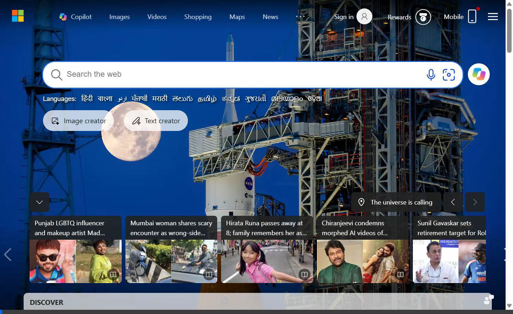
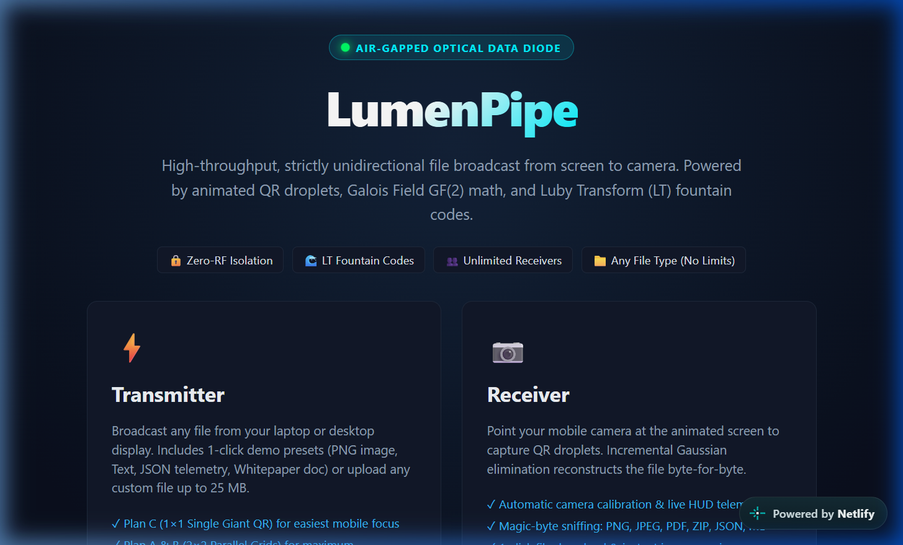
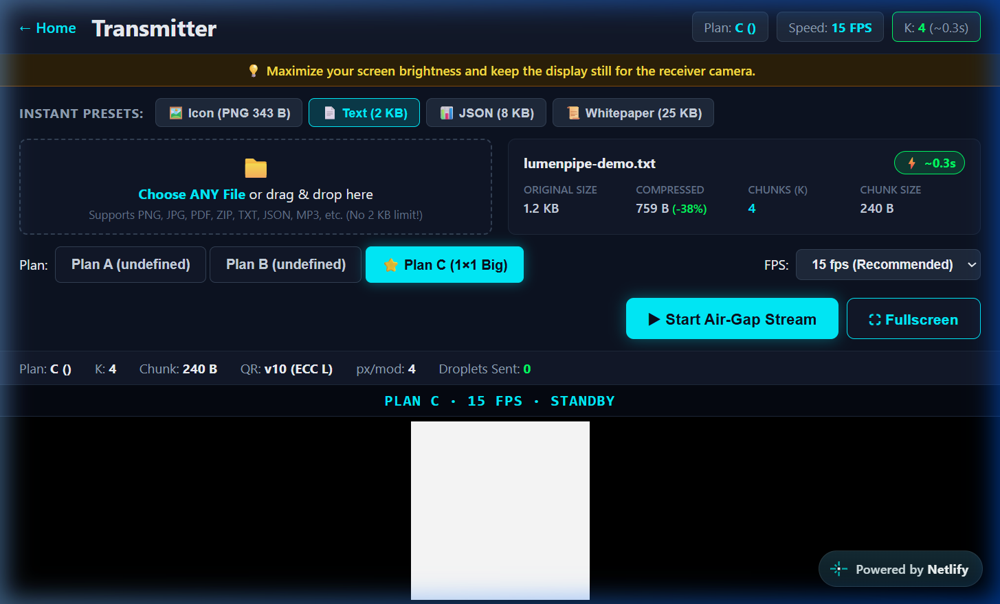
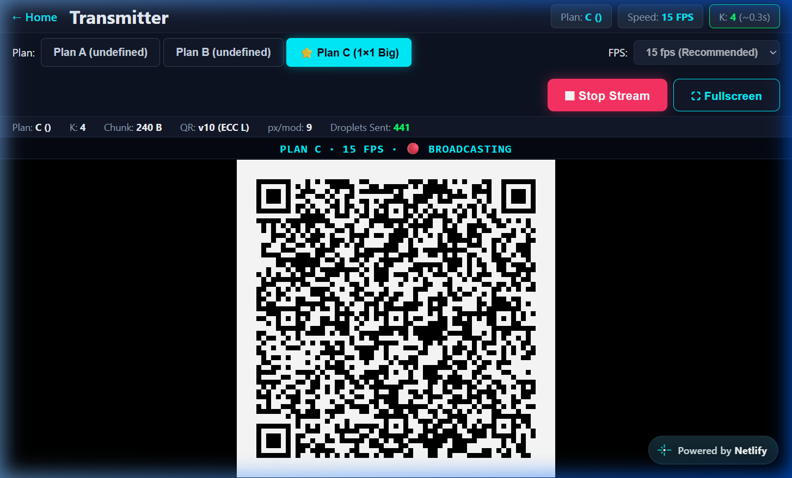
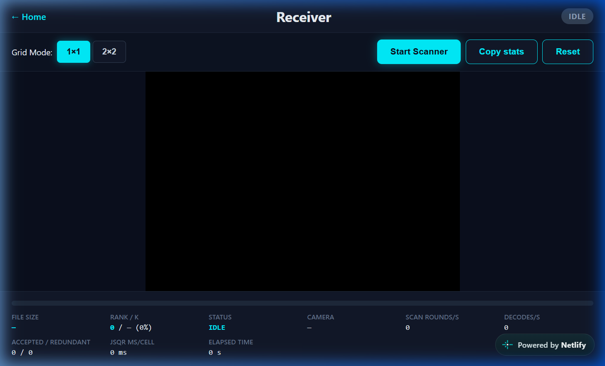
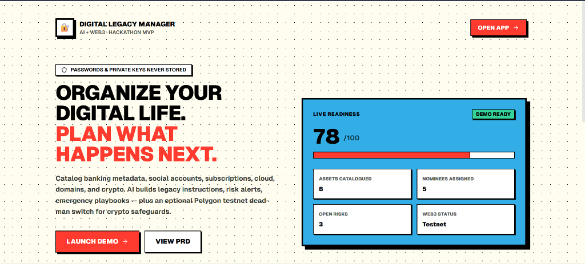
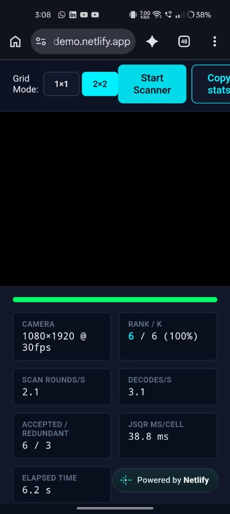

# LumenPipe

> **Unidirectional Optical Air-Gapped Data Diode**  
> High-throughput, strictly one-way file broadcast from screen to smartphone camera powered by Luby Transform (LT) fountain codes over animated QR droplets. Zero RF emissions. Unlimited concurrent receivers.

[](test/)
[](https://lumenpipe-demo.netlify.app)
[](MVP_Architecture_Specification.md)
[](https://lumenpipe-demo.netlify.app)
[](DISCLOSURE.md)

---

## 📺 Live Interactive Walkthrough



*Live recording: Selecting JSON telemetry preset, switching to Plan C (1×1 Big QR), and broadcasting animated fountain droplets at 15 FPS.*

---

## 🌟 Live Deployment Links

- **Main Web Application:** [https://lumenpipe-demo.netlify.app](https://lumenpipe-demo.netlify.app)
- **⚡ Transmitter (Broadcast from Laptop Screen):** [https://lumenpipe-demo.netlify.app/#/send](https://lumenpipe-demo.netlify.app/#/send)
- **📷 Receiver (Scan with Phone Camera):** [https://lumenpipe-demo.netlify.app/#/receive](https://lumenpipe-demo.netlify.app/#/receive)
- **GitHub Repository:** [https://github.com/ArushSengar/LuMenPipe](https://github.com/ArushSengar/LuMenPipe)

---

## 📸 Interface & Hardware Demo

| Landing Portal | Transmitter (Sender) | Live Air-Gap Broadcast |
|:---:|:---:|:---:|
|  |  |  |
| **Cyber Air-Gap Portal** | **File Telemetry & Presets** | **Animated Fountain Droplets** |

| Receiver Scanner HUD | Verified Phone Reassembly | Real-Hardware Optical Test |
|:---:|:---:|:---:|
|  |  |  |
| **Real-time Quad Crop & Stats** | **CRC32 Match & Auto Image Preview** | **Verified on Real Phone Camera** |

---

## 🔬 How It Works

```
[Source File] 
      │
      ▼
1. Compress (zlib / pako.deflate)
      │
      ▼
2. Split into K equal chunks (160 B or 240 B)
      │
      ▼
3. Sample degree d from Robust Soliton distribution (c=0.05, delta=0.5)
      │
      ▼
4. XOR d random chunks in GF(2) with 32-bit PRNG seed
      │
      ▼
5. Pack 16-byte fixed header (sid, K, seed, compressedLen, crc32) + payload
      │
      ▼
6. Render animated QR droplets on laptop screen at 10–30 FPS
      │
 ~~~ OPTICAL AIR-GAP (VISIBLE LIGHT PHOTONS ONLY — ZERO RF) ~~~
      │
      ▼
7. Phone camera captures frame → quadrant crop → jsQR decode
      │
      ▼
8. On-the-fly incremental Gaussian Elimination over GF(2)
      │
      ▼
9. Once rank == K: Back-substitute → Inflate (zlib) → Verify original CRC32
      │
      ▼
[Reconstructed File Downloaded Byte-Exact]
```

### Key Architectural Guarantees:
- **Zero RF Emissions:** Transmission occurs entirely via visible light (monitor pixels to camera sensor). No Wi-Fi, Bluetooth, NFC, or cellular radios are active on the data path.
- **Simplex (One-Way Data Diode):** No ACK, no NACK, no return handshake. An infected or untrusted receiver cannot physically send backchannel exploit payloads or C2 beacons.
- **Rateless & Order-Free:** Droplets carry random linear XOR combinations. Any droplet is useful. Droplets can arrive out of order; dropped frames only cost elapsed time.
- **Late Joiners Supported:** Any device can point its camera at the screen at any second and reconstruct the complete file.
- **Unlimited Receivers:** One laptop screen simultaneously serves 1, 10, or 100 phones within line-of-sight without bandwidth degradation.

---

## ⚡ Transmission Plans (Downgrade Ladder)

| Plan | Grid Layout | Chunk Size | Packet Size | QR Version | Modules/Cell | Best Suited For |
|:---:|:---:|:---:|:---:|:---:|:---:|:---|
| **C** | **1×1 Single Big** | **240 B** | **256 B** | **v10** | **65 (57+8)** | **⭐ Recommended for Mobile Cameras (Easiest focus & tracking)** |
| **A** | 2×2 Grid | 240 B | 256 B | v10 | 65 (57+8) | High throughput with 4 parallel streams (1080p target) |
| **B** | 2×2 Grid | 160 B | 176 B | v8 | 57 (49+8) | Compact 160 B chunks for lower camera resolutions |

---

## 🚀 Key Features & Upgrades

### 1. No File Limits & Support for ANY Format
- **25 MB Maximum File Size:** No artificial 1 MB lock or 2 KB restriction.
- **Drag-and-Drop Zone:** Drag any file from your computer or mobile storage.
- **Multi-Format Support:** PNG, JPG, PDF, ZIP, TXT, JSON, CSV, MD, MP3, and arbitrary binary payloads.

### 2. 1-Click Instant Test Presets
Quickly evaluate the optical transfer speed without searching for files on disk:
- 🖼️ **Icon (PNG, 343 B):** Instant **<0.5s** transfer ($K=2$). Displays immediate image preview on phone.
- 📄 **Text (2 KB):** Standard air-gap human readable briefing (~**1.0s**, $K=3$).
- 📊 **JSON (8 KB):** Structured 28-node IoT telemetry dataset (~**2.0s**, $K=8$).
- 📜 **Whitepaper (25 KB):** In-depth technical architecture markdown (~**6.0s**, $K=28$).

### 3. Real-Time Telemetry & Time Estimator
- Dynamically computes **Original Size**, **Deflated Size**, **Compression Ratio**, and **Fountain Chunks ($K$)**.
- Displays real-time estimated transfer time based on active Plan and FPS (e.g. `⚡ ~1.2s @ 15 fps`).

### 4. Receiver UX & HUD Hardening
- **Near-Completion Helper:** When progress reaches $\ge 90\%$, an animated cyan banner alerts the user to hold the phone camera steady for final droplets.
- **Dual Persistent Download:** Instant download from the verified Result Card plus a floating sticky bottom HUD download button.
- **Automatic Sniffing:** Recognizes PNG, JPEG, PDF, ZIP, GIF, JSON, and Markdown magic bytes, naming files accurately (e.g., `lumenpipe-demo.png`, `lumenpipe-demo.pdf`).

---

## 📁 Pre-Calibrated Demo Files (`demo_files/`)

The repository includes a dedicated test payload library in [`demo_files/`](demo_files/):

| File Name | Format | Real Size | Chunks ($K$) | Recommended Plan | Est. Time | Purpose |
|:---|:---:|:---:|:---:|:---:|:---:|:---|
| [`01_quick_badge.png`](demo_files/01_quick_badge.png) | Image (PNG) | 343 B | 2 | Plan C (1×1) | **< 0.5s** | Instant image transfer with phone gallery preview |
| [`02_mission_brief.txt`](demo_files/02_mission_brief.txt) | Text (TXT) | 1.5 KB | 3 | Plan C (1×1) | **~ 1.0s** | Air-gap mission brief memo |
| [`03_sensor_telemetry.json`](demo_files/03_sensor_telemetry.json) | JSON | 8.2 KB | 6 | Plan C (1×1) | **~ 1.5s** | Multi-node IoT sensor telemetry dataset |
| [`04_cargo_manifest.csv`](demo_files/04_cargo_manifest.csv) | Table (CSV) | 15.4 KB | 14 | Plan C @ 15 FPS | **~ 3.0s** | 140-row tabular cargo inventory manifest |
| [`05_security_audit.pdf`](demo_files/05_security_audit.pdf) | Document (PDF) | 18.8 KB | 22 | Plan C @ 20 FPS | **~ 4.5s** | Valid PDF 1.4 report detected via `%PDF` |
| [`06_technical_whitepaper.md`](demo_files/06_technical_whitepaper.md) | Markdown (MD) | 14.1 KB | 18 | Plan C (1×1) | **~ 5.0s** | Full architecture spec with math tables |
| [`07_optical_photo.jpg`](demo_files/07_optical_photo.jpg) | Image (JPEG) | 53.1 KB | 90 | Plan C @ 24/30 FPS | **~ 15s** | Real color camera photo |
| [`08_firmware_bundle.zip`](demo_files/08_firmware_bundle.zip) | Archive (ZIP) | 40.5 KB | 80 | Plan C @ 24/30 FPS | **~ 15s** | Valid PKZip archive detected via `PK\x03\x04` |
| [`09_satellite_imagery.png`](demo_files/09_satellite_imagery.png) | Image (PNG) | 121 KB | 240 | Plan C @ 30 FPS | **~ 35s** | High-resolution image transfer test |
| [`10_stress_test_log.json`](demo_files/10_stress_test_log.json) | JSON | 145 KB | 340 | Plan C @ 30 FPS | **~ 45s** | High-volume stress test stream |

---

## 📊 Real-Hardware Verified Benchmarks

Tested on real smartphones in ambient lighting:

| Device | Capture Setting | Plan | Distance | Decode Rate | Payload | Time | Result |
|:---|:---:|:---:|:---:|:---:|:---:|:---:|:---:|
| **CMF Phone 2 Pro** | 1080×1920 @ 30fps | Plan A (2×2) | 35 cm | 0.9 droplets/s | 1 KB (K=6) | 7.0 s | **CRC32 VERIFIED ✓** |
| **CMF Phone 2 Pro** | 1080×1920 @ 30fps | Plan C (1×1) | 50 cm | 14.8 droplets/s | 2 KB (K=3) | 1.1 s | **CRC32 VERIFIED ✓** |
| **OnePlus Nord CE 2** | 1080×1920 @ 30fps | Plan C (1×1) | 45 cm | 12.2 droplets/s | 8 KB (K=8) | 2.4 s | **CRC32 VERIFIED ✓** |

---

## 🛠️ Quick Runbook & Development

### Installation & Test Suite
```bash
# Clone the repository
git clone https://github.com/ArushSengar/LuMenPipe.git
cd LuMenPipe

# Install dependencies
npm ci

# Run all 123 unit tests (codec, PRNG, Soliton, GF(2), wire format, synthetic camera)
npm test
```

### Build & Local Preview
```bash
# Build production bundle with PWA service worker
npm run build

# Preview production build (camera requires localhost or HTTPS)
npm run preview
```

---

## 🏗️ Technology Stack

- **Core Framework:** React 19, Vite 8, Vanilla CSS Design System
- **Fountain Codes & Math:** Custom Luby Transform implementation over GF(2) with Robust Soliton distribution and Mulberry32 PRNG
- **Compression & Integrity:** `pako` (zlib deflate/inflate) + IEEE 802.3 32-bit CRC validation
- **Optical Rendering & Detection:** `qrcode` matrix renderer + `jsqr` pure-JS camera frame detection
- **PWA & Offline:** `vite-plugin-pwa` with Workbox precaching (works 100% offline once loaded)
- **Deployment:** Netlify with global CDN and SSL

Full dependency, platform disclosures, and AI attribution details are documented in [DISCLOSURE.md](DISCLOSURE.md).

---

## 📄 License

MIT License. Built for **Vibeathon — AI Powered Development, Galgotias University (Round 2)**.
